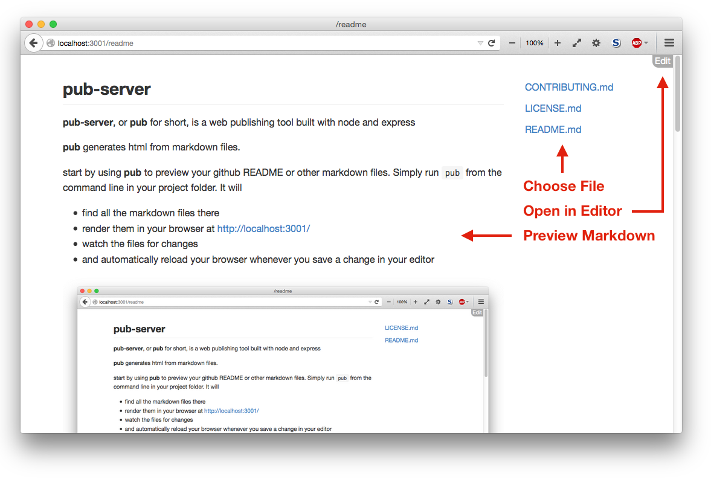
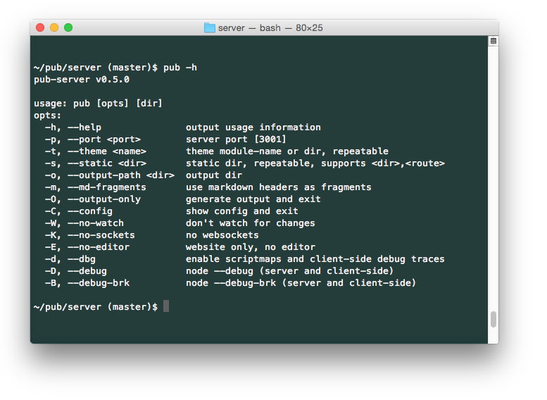
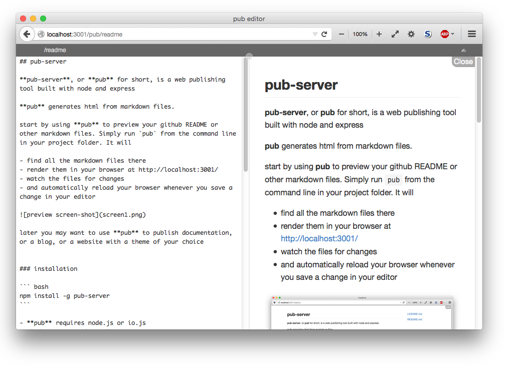

## pub-server

**pub-server**, or **pub** for short, is a web publishing tool built with node and express.

**pub** generates html from markdown files.

Start by using **pub** to preview your github README or other markdown files. Simply run `pub` from the command line in your project folder. It will

- find all the markdown files there
- render them in your browser at http://localhost:3001/
- watch the files for changes
- and automatically reload your browser whenever you save a change in your editor



Later you may want to use **pub** for documentation, a blog, or a website with a theme of your choice.


### installation

**pub** requires node.js or io.js.

``` bash
npm install -g pub-server
```

Windows support is coming - PRs welcome.


### usage




### editor with instant preview

**pub-editor** was designed for self-service editing online.

You can also use it to edit your markdown when pub is running locally.

- click on `Edit` at the top right 
- this prepends `/pub` to the url which opens the page in the editor
- adjust the split between the panes by dragging the separator at the top
- edit the markdown on the left, and see the result instantly in the preview on the right
- **NOTE: your changes will be saved immediately, overwriting the file**
- use git to validate the changes before committing




### packages and themes

- **pub-server** can be extended with npm packages containing plugins and themes
- the default theme for pub-server is [pub-theme-gfm](https://github.com/jldec/pub-theme-gfm)
- the editor is [pub-pkg-editor](https://github.com/jldec/pub-pkg-editor)


### credits

Major dependencies include:

- [express](http://expressjs.com/)
- [marked](https://github.com/chjj/marked)
- [handlebars](http://handlebarsjs.com/)
- [browserify](http://browserify.org/) and [browserify-middleware](https://github.com/ForbesLindesay/browserify-middleware)
- [chokidar](https://www.npmjs.com/package/chokidar)
- [socket.io](http://socket.io/)
- [passport](http://passportjs.org/)

`npm ls` will list them all.
